<div align="center"><br><br><br>


<br><br>

<a href="https://github.com/sindhukonda32-hash">

</a>
&nbsp;
<a href="https://www.linkedin.com/in/sindhu-konda-ab5089325/">

</a>
&nbsp;
<a href="mailto:sindhukonda32@gmail.com">

</a><br><br>

</div>---

🧠 AI ENGINEERING PROFILE

<table>
<tr>
<td width="60%">Hi, I'm Satya Sindhu Konda 👋

I'm a B.Tech Artificial Intelligence & Machine Learning student passionate about building practical solutions with Python, Machine Learning, NLP and Data Science.

I enjoy transforming ideas into working systems and learning through hands-on projects involving NLP-based evaluation, prediction models and recommendation systems.

My goal is to continuously strengthen my engineering skills and grow into a capable AI/ML Engineer.

</td><td width="40%"><div align="center">PROFILE SIGNAL

<br>🎓 B.Tech AI & ML

<br>📈 8.5 / 10 CGPA

<br>🐍 Python

<br>🤖 AI / ML

<br>🧠 NLP

<br>📊 Data Science

</div></td>
</tr>
</table>---

⚡ WHAT I BUILD

<div align="center">🤖 INTELLIGENCE| ⚙️ ENGINEERING| 📊 DATA
Machine Learning| Python Development| Data Analysis
NLP| Git & GitHub| Pandas
Semantic Matching| OOP| NumPy
Recommendation Systems| Problem Solving| SQL

</div>---

🛠️ TECHNOLOGY STACK

<div align="center"><br><br>


</div>---

🧩 AI / ML EXPERTISE

<div align="center">DOMAIN| FOCUS
🤖 Machine Learning| Supervised Learning • Preprocessing • Model Evaluation
🧠 Natural Language Processing| Keyword Extraction • Tokenization • Semantic Matching
📊 Data Science| Data Analysis • Pandas • NumPy
⚙️ ML Workflow| Feature Engineering • Model Development • Evaluation
📚 Recommendation Systems| Similarity-Based Filtering • Personalized Recommendations

</div>---

🚀 FEATURED PROJECTS

<table>
<tr><td width="50%">🧠 Keyword-Based Answer Evaluation

An NLP-based system designed to evaluate candidate responses using keyword extraction and semantic matching.

Core Work

- Keyword extraction
- Tokenization
- Stop-word removal
- Semantic matching
- Automated evaluation

Stack

"Python" "NLTK" "Sentence Transformers"

<br><a href="https://github.com/sindhukonda32-hash/keyword_answer_evaluation">

</a></td><td width="50%">🏠 House Price Prediction

A machine learning project focused on predicting house prices using preprocessing, feature engineering and regression techniques.

Core Work

- Data preprocessing
- Feature engineering
- Regression algorithms
- Model evaluation
- Prediction workflow

Stack

"Python" "Pandas" "NumPy" "Scikit-Learn"

<br><a href="https://github.com/sindhukonda32-hash/House-Price-Prediction">

</a></td></tr><tr><td width="50%">📚 Book Recommendation System

A similarity-based recommendation engine designed to generate personalized book suggestions.

Core Work

- Similarity-based filtering
- Recommendation generation
- Data processing
- Personalized suggestions

Stack

"Python" "Pandas" "NumPy"

<br><a href="https://github.com/sindhukonda32-hash/book-ai-project">

</a></td><td width="50%">📈 Sales Forecasting

A forecasting project exploring time-series and machine-learning approaches for sales prediction.

Core Work

- Time-series analysis
- Forecasting
- Model comparison
- Visualization
- Prediction insights

Stack

"Python" "Pandas" "Machine Learning"

<br><a href="https://github.com/sindhukonda32-hash/SalesForecasting_Satya_Sindhu_Konda">

</a></td></tr>
</table>---

💼 EXPERIENCE

<div align="center">🧪 AI & Data Science Intern

XYlofy AI

Remote · Jun 2026 – Jul 2026

</div>Gained practical exposure across Artificial Intelligence, Machine Learning, Data Science and Data Analytics, with hands-on experience understanding real-world AI and data-driven workflows.

Areas of Exposure

"Artificial Intelligence" · "Machine Learning" · "Data Science" · "Data Analytics"

---

🎓 EDUCATION

<div align="center">B.Tech — Artificial Intelligence & Machine Learning

Srinivasa Institute of Engineering and Technology

"2024 — 2028"

<br><br><br>

"Data Structures" · "Machine Learning" · "Artificial Intelligence" · "Database Management Systems"

</div>---

🏅 CERTIFICATIONS

<div align="center"></div>---

📊 GITHUB LAB

<div align="center">DEVELOPMENT TELEMETRY

<br>
<br><br>

</div>---

📈 CONTRIBUTION FLOW

<div align="center"></div>---

🐍 CONTRIBUTION SNAKE

<div align="center"><picture><source
media="(prefers-color-scheme: dark)"
srcset="https://raw.githubusercontent.com/sindhukonda32-hash/sindhukonda32-hash/output/github-contribution-grid-snake-dark.svg">

<source
media="(prefers-color-scheme: light)"
srcset="https://raw.githubusercontent.com/sindhukonda32-hash/sindhukonda32-hash/output/github-contribution-grid-snake.svg">


</picture></div>---

🛰️ CURRENT AI MISSION

<table>
<tr><td align="center" width="20%">01

LEARN

Strengthen AI/ML fundamentals.

</td><td align="center" width="20%">02

EXPLORE

Understand modern AI technologies.

</td><td align="center" width="20%">03

BUILD

Turn concepts into practical projects.

</td><td align="center" width="20%">04

EXPERIMENT

Test ideas and continuously improve.

</td><td align="center" width="20%">05

CREATE

Build useful intelligent solutions.

</td></tr>
</table>---

🔭 CURRENTLY EXPLORING

<div align="center">


</div>---

<div align="center">✦ LEARN • BUILD • EXPERIMENT • CREATE ✦

<br><a href="https://github.com/sindhukonda32-hash">

</a><br><br>

</div>
```That's the complete file. Don't add or remove anything before the first "<div>" or after the final "</div>".

Now Preview first — don't commit yet.
